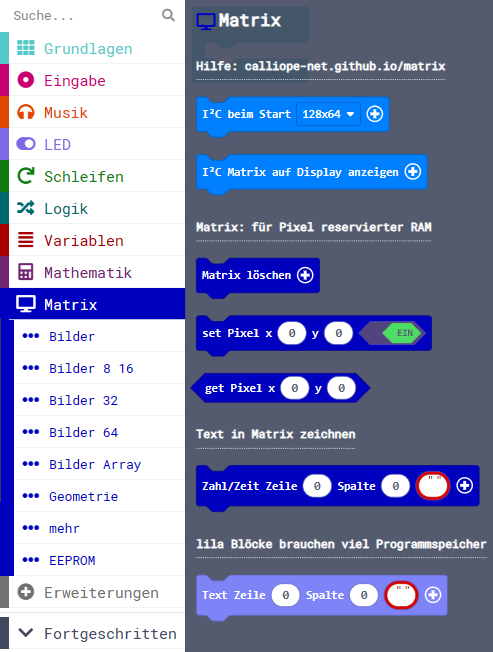
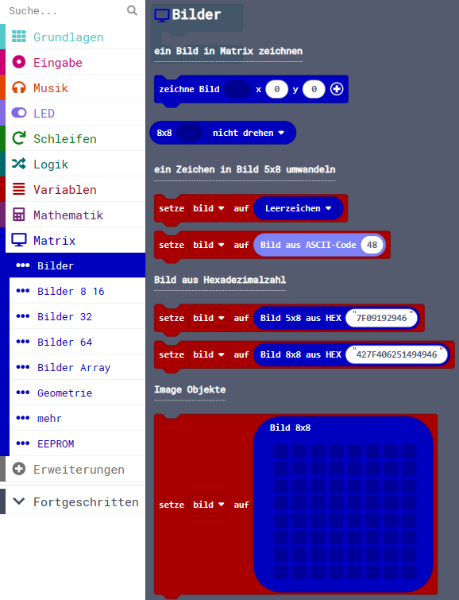

> Diese Seite bei [https://calliope-net.github.io/matrix/](https://calliope-net.github.io/matrix/) öffnen.

### Calliope Erweiterung für I²C OLED Displays 128x128 und 128x64 Pixel

> speichert alle Pixel im RAM (2048 oder 1024 Byte), deshalb Calliope mini ab V2 erforderlich

> zeichnet Linien, Kreise oder eine analoge Uhr

> Bilder verschiedener Größe 5x8 bis 64x64 Pixel mit Blöcken selbst malen

> Text pixelgenau positionieren, drehen, spiegeln, in verschiedene Richtungen zeichnen

> Bilder (auch Text-Zeichen sind Bilder 5x8) vergrößern (in x und y Richtung getrennt strecken)

> mehrere Bilder als Animation anzeigen

> zwei Displays mit verschiedenen I²C Adressen können verschiedene Bilder zeigen

Erweiterung unterstützt verschiedene OLED Displays, folgende wurden getestet:

* [Grove - OLED Display 1.12 (SH1107) V3.0 - SPI/IIC -3.3V/5V](https://wiki.seeedstudio.com/Grove-OLED-Display-1.12-SH1107_V3.0/)

_V3.0/img/10402050_Main-02.png)

* [Grove - OLED Display 0.96 inch](https://wiki.seeedstudio.com/Grove-OLED_Display_0.96inch/)

* [Grove - OLED Yellow&Blue Display 0.96(SSD1315) - SPI/IIC -3.3V/5V](https://wiki.seeedstudio.com/Grove-OLED-Yellow&Blue-Display-0.96-SSD1315_V1.0/)

_V1.0/img/10402049_Preview-07.png)

Dieses Repository kann als **Erweiterung** in MakeCode hinzugefügt werden.

* öffne Makecode in der App oder die Webseite [https://makecode.calliope.cc/](https://makecode.calliope.cc/)
* klicke auf **Neues Projekt** und gib deinem Projekt einen Namen
* wähle die zu deinem Calliope mini passende Hardware v2 oder v3
* mit Calliope 1.3 (v1) funktioniert diese Erweiterung nicht
* klicke auf **Erweiterungen**
* schreibe die folgende **Projekt-URL**:
* **calliope-net/matrix**
* mit der Tastatur oben in das weiße Feld und klicke auf ENTER
* klicke auf das Rechteck **matrix** (kann von der Tastatur verdeckt sein)
* jetzt hat die Liste den neuen Eintrag **Matrix** bekommen

### Beschreibung der Erweiterung 'Matrix'

##### I²C

Matrix speichert alle Pixel im RAM. Zur Kommunikation mit dem Display über den I²C-Bus gibt es nur 3 Blöcke (hellblau):

* **beim Start** (Display-Größe, invert, drehen, I²C-Adresse)
* **Matrix auf Display** schreiben (Zeilen von, bis,  I²C-Adresse)
* **Animation auf Display schreiben** (Image[]-Array, Position x, y, Vergrößern x, y, Pause(ms), Zeilen von, bis,  I²C-Adresse)

**beim Start** muss beim Start aufgerufen werden, um den RAM (die Matrix) und das Display zu initialisieren. 
Die eingestellte Größe entscheidet darüber, wieviel RAM reserviert wird. 128x64 reserviert 1KB und 128x128 2KB.
*invert* stellt ein, ob die Pixel leuchten oder der Hintergrund. 
Mit *drehen* wird das Bild auf den Kopf gestellt, wenn das Display anders herum eingebaut ist.
Die *I²C-Adresse* muss nur umgestellt werden, wenn ein zweites Display angeschlossen wird.

Die optionalen Parameter können weg gelassen werden. Sie werden bei Bedarf mit dem + angezeigt. 

**Matrix auf Display schreiben** ist immer aufzurufen, wenn das in den RAM gezeichnete Bild angezeigt werden soll.
Dabei wird normalerweise das komplette Display über den I²C-Bus neu geschrieben (1KB oder 2KB Pixel).

Über den I²C-Bus zum Display werden nur komplette 'Pages' aus dem RAM gesendet.

* Abc

### Erweiterungen

> [Upates für Erweiterungen; Erweiterungen aus einem Projekt löschen.](https://calliope-net.github.io/i2c-liste#updates)

> [Alle I²C-Erweiterungen für MakeCode von calliope-net (Software).](https://calliope-net.github.io/i2c-liste#erweiterungen)

#### Calliope-Apps, .hex-Dateien, Bildschirmfotos mit Blöcken

> [Alle Beispiel-Projekte für MakeCode von calliope-net (Calliope-Apps).](https://calliope-net.github.io/i2c-liste#programmierbeispiele)

> GitHub-Profil calliope-net: [https://github.com/calliope-net](https://github.com/calliope-net)

### Bezugsquellen

> [Alle I²C-Module und Bezugsquellen (Hardware).](https://calliope-net.github.io/i2c-liste#bezugsquellen)

#### Blocks preview 

This image shows the blocks code from the last commit in master.
This image may take a few minutes to refresh.

#### Metadaten (verwendet für Suche, Rendering)

* Calliope mini
* I²C
